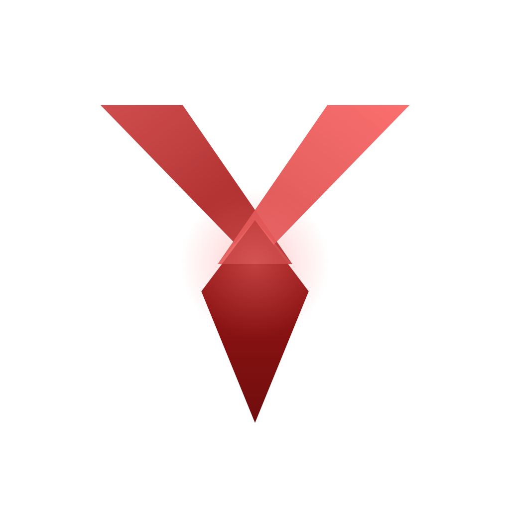
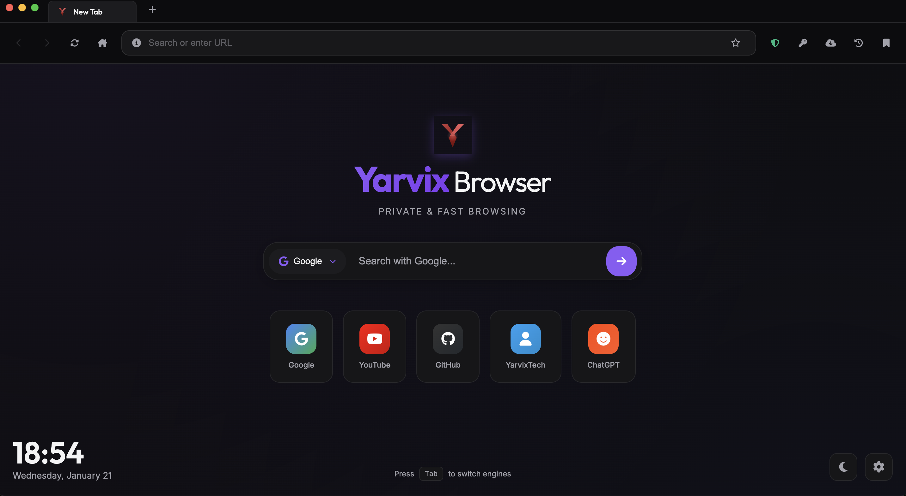
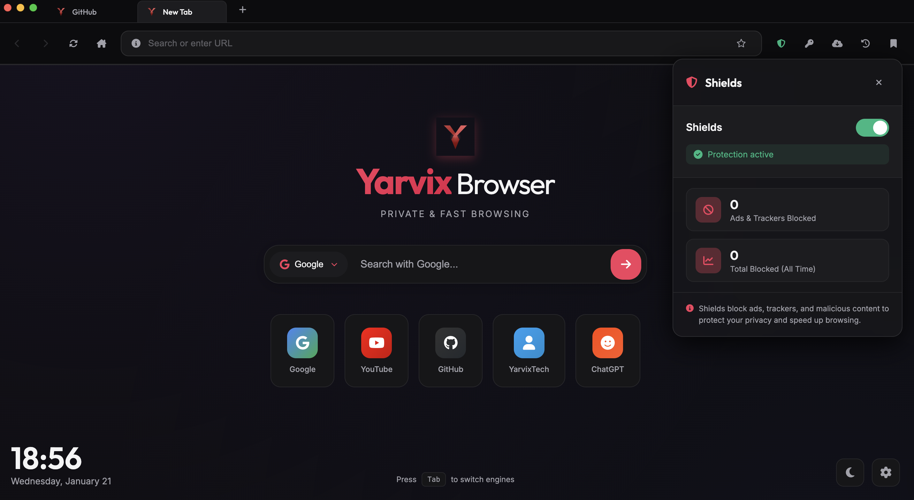

# 🦊 YarvixBrowser

<div align="center">



**The Ultimate Stealth Browser** - A private, fast, and customizable web browser built with Electron.

[](https://github.com/your-username/your-browser)
[](https://www.electronjs.org/)
[](README.md)

</div>

---

## ✨ Features

### 🔒 Privacy & Security

| Feature | Description |
|---------|-------------|
| **Screen Capture Detection** | Automatically detects when screen is being recorded or screenshots are taken |
| **Content Protection** | Prevents your browser window from appearing in screenshots/screen recordings |
| **Ad Blocker** | Built-in YouTube ad blocker that removes video ads, overlay ads, and display ads |
| **Whitelist Management** | Whitelist specific sites to disable ad blocking when needed |
| **Service Worker Management** | Clear corrupted service worker data to fix website issues |

### 🔑 Password Manager

| Feature | Description |
|---------|------------- |
| **Secure Credential Storage** | Save and manage passwords with AES-256-GCM encryption |
| **Touch ID Authentication** | Authenticate with Touch ID before autofilling passwords (macOS) |
| **Autofill Support** | Auto-fill login forms on supported websites |
| **URL Suggestions** | Sites with saved passwords appear at the top of URL bar suggestions |
| **Credential Dashboard** | View, search, and manage all saved credentials |
| **Never Save Sites** | Mark specific sites to never save passwords |

### 🎨 Customization

| Feature | Description |
|---------|-------------|
| **Theme System** | Choose between Dark and Light modes |
| **6 Color Accents** | Purple (default), Blue, Cyan, Emerald, Rose, Orange |
| **Customizable Homepage** | Set your own homepage with quick links |
| **Search Engine Selection** | Choose your preferred search engine (Google, Bing, DuckDuckGo, etc.) |

### 🗂️ Browsing Features

| Feature | Description |
|---------|-------------|
| **Tabbed Browsing** | Multiple tabs with fast switching |
| **Bookmarks Bar** | Quick access to favorite sites |
| **History Management** | View and clear browsing history |
| **Download Manager** | Built-in download tracking with progress |
| **Find in Page** | Search within the current page |
| **Keyboard Shortcuts** | Full keyboard navigation support |

---

### Browser Interface




### Shields Panel (Ad Blocker)



---

## 🚀 Quick Start

### Prerequisites

- **macOS** 10.15 or later
- **Node.js** v18 or later
- **npm** (comes with Node.js)

### Installation

```bash
# Clone the repository
git clone https://github.com/your-username/your-browser.git
cd your-browser

# Install dependencies
npm install

# Run in development mode
npm start
```

### Building for macOS

```bash
# Build unsigned DMG for personal use
CSC_IDENTITY_AUTO_DISCOVERY=false npm run build:mac

# Built files will be in dist/ folder
```

---

## ⌨️ Keyboard Shortcuts

| Shortcut | Action |
|----------|--------|
| `Cmd/Ctrl + T` | New Tab |
| `Cmd/Ctrl + W` | Close Tab |
| `Cmd/Ctrl + Shift + T` | Reopen Closed Tab |
| `Cmd/Ctrl + L` | Focus URL Bar |
| `Cmd/Ctrl + R` | Refresh Page |
| `Cmd/Ctrl + Shift + R` | Hard Refresh |
| `Cmd/Ctrl + D` | Bookmark Page |
| `Cmd/Ctrl + F` | Find in Page |
| `Cmd/Ctrl + N` | New Window |
| `Cmd/Ctrl + Tab` | Next Tab |
| `Cmd/Ctrl + Shift + Tab` | Previous Tab |
| `Cmd/Ctrl + 1-9` | Switch to Tab 1-9 |
| `Cmd/Ctrl + 0` | Switch to Last Tab |
| `Cmd/Ctrl + +/-` | Zoom In/Out |
| `Escape` | Stop Loading / Close Panels |

---

## 📁 Project Structure

```
your-browser/
├── main.js              # Electron main process (app lifecycle, IPC)
├── renderer.js          # Browser UI logic (tabs, navigation, etc.)
├── index.html           # Main browser window HTML
├── homepage.html        # New tab page
├── style.css            # All browser styles (stealth theme)
├── credentialManager.js # Password encryption & storage
├── adblock.js           # Ad blocker logic
├── package.json         # Project config & dependencies
├── icon.svg             # Browser icon
├── alert-image.svg      # Alert overlay icon
├── build/               # Build resources (icons)
│   └── icons/
│       └── icon.icns    # macOS app icon
├── dist/                # Built applications
└── scripts/             # Build scripts
```

---

## 🔧 Technical Details

### Password Security

YarvixBrowser uses industry-standard encryption for password storage:

- **Primary**: Electron's `safeStorage` API (macOS Keychain)
- **Fallback**: AES-256-GCM encryption with per-file keys
- **Authentication**: Touch ID / system authentication before autofill

### Ad Blocker

The built-in ad blocker provides:

- YouTube video ad skipping (skip button clicks + fast-forward)
- Overlay ad removal
- Display ad blocking
- Custom whitelist per site

### Content Protection

The browser can prevent screen capture

---

## 📝 License

This project is private and developed by **Yash Vyas**.

---

## 🤝 Contributing

This is a personal project. For suggestions or improvements, please contact:

- **Author**: Yash Vyas
- **Email**: dev.yashvyas@gmail.com
- **Work**: https://yarvix.space

---

<div align="center">

**Built with YarvixTech**

</div>

